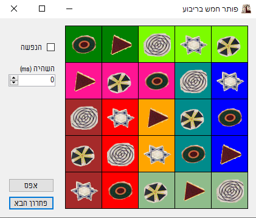

# FiveSquaredSolver
 

A solver for [Five Squared game](https://thinkingames.com/en/product/%d7%97%d7%9e%d7%a9-%d7%91%d7%a8%d7%99%d7%91%d7%95%d7%a2/).
This is a board game for 1 player. There is 5x5 board, 7 pieces 3x1 and 2 pieces 2x1. Each piece has 3 different shapes on it.
The player has to fill the board with all pieces, while same shape must not appear twice in the same row or column. 

